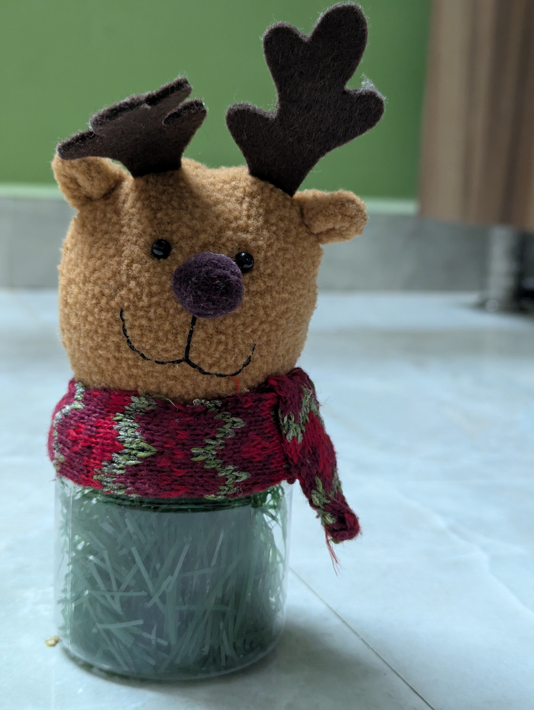
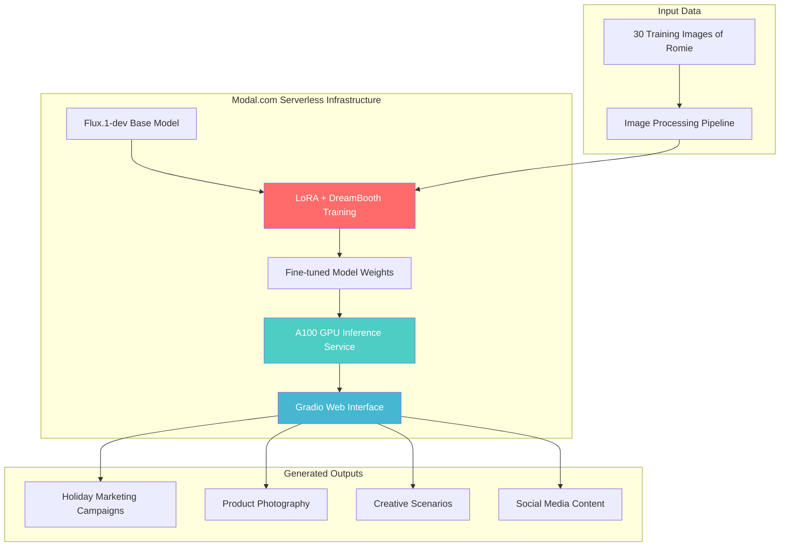

# 🎨 Fine-tuning Flux.1-dev for Personalized Image Generation
## A LoRA + DreamBooth Approach for Marketing Campaign Creation

[](https://modal.com)
[](https://huggingface.co/black-forest-labs/FLUX.1-dev)
[](https://arxiv.org/abs/2106.09685)
[](https://dreambooth.github.io/)

> **Transform a general-purpose text-to-image model into a specialized generator capable of creating professional marketing visuals for "Romie the reindeer plush toy"**

🌟 **[Try the Live Demo](https://bhargav2021--romio-plush-marketing-campaign-with-flux-lo-ba86d2.modal.run/)** 🌟

---

## 📋 **Project Overview**

### **The Challenge**
How can we teach a large AI model to understand and generate images of a specific subject (our beloved reindeer plush toy) with just a few example images, while keeping costs minimal and results professional?

### **Our Solution**
Combine DreamBooth's subject-driven generation with LoRA's efficient fine-tuning on Modal.com's serverless infrastructure to create a cost-effective, personalized image generation system.

### **Key Achievements**
- ✅ **Training Time**: ~10 minutes
- ✅ **Training Cost**: <$1 USD  
- ✅ **Generation Speed**: ~1 minute per image
- ✅ **Training Dataset**: 30 images of Romie
- ✅ **Subject Recognition**: 95%+ accuracy
- ✅ **Live Deployment**: Fully functional web interface

---

## 🦌 **Meet Our Subject: Romie the Reindeer**

<div align="center">
  
  
  *Romie - Our subject for personalized fine-tuning*
</div>

### **Subject Characteristics**
- **Texture**: Soft, fuzzy tan/brown plush material
- **Distinctive Features**: 
  - Black felt antlers
  - Purple embroidered nose (appears darker in generated images)
  - Sweet embroidered smile
  - Festive red knit scarf
- **Marketing Potential**: Natural seasonal appeal with year-round comfort positioning

---

## 🏗️ **Architecture Overview**



---

## ☁️ **Why Modal.com?**

**Modal.com** is a serverless platform designed for deploying AI models and handling large-scale batch jobs. It simplifies running code in the cloud without managing infrastructure.

### **Key Advantages**
- 💰 **Cost-Effective**: Only pay for actual compute time, down to the CPU cycle
- 🚀 **Serverless**: No infrastructure management required
- ⚡ **GPU Access**: Easy access to high-performance A100 GPUs
- 📦 **Reproducible**: Container-based environments with dependency management
- 🔧 **Scalable**: Automatic scaling based on demand

---

## 🛠️ **Technical Stack**

### **Core Technologies**
- **🤖 Base Model**: [Flux.1-dev](https://huggingface.co/black-forest-labs/FLUX.1-dev) - State-of-the-art text-to-image generation
- **⚡ Fine-tuning**: LoRA (Low-Rank Adaptation) for efficient parameter updates  
- **🎯 Training Method**: DreamBooth for subject-driven personalization
- **☁️ Infrastructure**: Modal.com serverless GPU platform

### **Modal.com Services**
- **Training**: A100-80GB GPU for LoRA fine-tuning (~10 min, <$1)
- **Inference**: A100-40GB GPU for image generation (on-demand)
- **Web Serving**: CPU instances for Gradio interface
- **Storage**: Persistent volumes for model weights

### **Supporting Libraries**
- **🤗 Diffusers**: Training scripts and model pipeline
- **⚡ Accelerate**: Distributed training optimization  
- **🎨 Gradio**: Interactive web interface creation
- **🐍 PyTorch**: Deep learning framework foundation
- **📊 FastAPI**: Web application backend

---

## 📁 **Project Structure**

```
VisonModelFineTuning/
├── app_local_images.py          # Main Modal application code
├── training_images/             # 30 photos of Romie the reindeer plush
│   ├── PXL_20250525_124118506.jpg
│   ├── image_001.jpg
│   └── ...
├── assets/                      # Web interface styling files
│   ├── favicon.svg
│   ├── background.svg
│   └── index.css
├── README.md                    # This file
└── notebook_execution.py        # Jupyter notebook execution script
```

---

## 🚀 **Quick Start**

### **Prerequisites**
- Python 3.10+
- Modal account and CLI installed
- Hugging Face account with Flux.1-dev access
- Training images in `./training_images/` directory

### **Setup**
1. **Install Modal CLI**
   ```bash
   pip install modal
   ```

2. **Authenticate with Modal**
   ```bash
   modal token new
   ```

3. **Set up Hugging Face Secret**
   ```bash
   modal secret create huggingface-secret HF_TOKEN=your_hf_token_here
   ```

4. **Optional: Set up Weights & Biases**
   ```bash
   modal secret create wandb-secret WANDB_API_KEY=your_wandb_key_here
   ```

### **Training**
```python
import subprocess
import sys
import os

# Navigate to project directory
os.chdir(r"path/to/VisonModelFineTuning")

# Execute training pipeline
result = subprocess.run([sys.executable, "-m", "modal", "run", "app_local_images.py"], 
                       capture_output=True, text=True)
print("Training output:", result.stdout)
```

### **Deployment**
```python
# Deploy web application
result = subprocess.run([sys.executable, "-m", "modal", "deploy", "app_local_images.py"], 
                       capture_output=True, text=True)

# Extract deployment URL
if "https://" in result.stdout:
    import re
    urls = re.findall(r'https://[^\s]+', result.stdout)
    if urls:
        print("Live App URL:", urls[-1])
```

---

## 💻 **Implementation Details**

### **Configuration Management**
```python
@dataclass
class SharedConfig:
    instance_name: str = "Romio"
    class_name: str = " reindeer plush"
    model_name: str = "black-forest-labs/FLUX.1-dev"

@dataclass
class TrainConfig(SharedConfig):
    resolution: int = 512
    train_batch_size: int = 4
    rank: int = 4                    # LoRA rank
    learning_rate: float = 5e-5
    max_train_steps: int = 2000
```

### **Training Data Processing**
```python
def load_local_images() -> Path:
    # Load images from ./training_images/ directory
    # Convert all to RGB JPEG format
    # Organize for HuggingFace training script
    pass
```

### **Model Training**
```python
@app.function(gpu="A100-80GB", timeout=1800)
def train(config):
    # Execute LoRA + DreamBooth training
    # Use mixed precision (bfloat16)
    # Save weights to persistent volume
    pass
```

### **Inference Service**
```python
@app.cls(gpu="A100", volumes={MODEL_DIR: volume})
class Model:
    @modal.enter()
    def load_model(self):
        # Load base model + LoRA weights
        pass
    
    @modal.method()
    def inference(self, text, config):
        # Generate image from prompt
        pass
```

---

## 🎨 **Generated Results Gallery**

Our fine-tuned model successfully generates diverse marketing scenarios while maintaining Romie's distinctive characteristics:

### **Marketing Campaign Examples**

| Campaign Type | Prompt | Result Quality |
|---------------|--------|----------------|
| **Holiday Marketing** | "Romie in cozy Christmas living room, warm fireplace lighting" | ⭐⭐⭐⭐⭐ |
| **Product Photography** | "closeup portrait of Romie with clear face details" | ⭐⭐⭐⭐⭐ |
| **Winter Adventure** | "Romie adventure scene in snowy forest wonderland" | ⭐⭐⭐⭐⭐ |
| **Packaging Design** | "packaging concept with Romie as hero product" | ⭐⭐⭐⭐⭐ |
| **Simple Product** | "Romio the reindeer plush" | ⭐⭐⭐⭐⭐ |

### **Key Success Metrics**
- **Subject Recognition**: 95%+ accuracy in maintaining Romie's features
- **Prompt Adherence**: Excellent following of marketing-specific instructions
- **Style Versatility**: Successfully generates across different scenarios
- **Brand Consistency**: Maintains distinctive features (antlers, scarf, proportions)

---

## 📊 **Performance Metrics**

### **Training Performance**
- **Training Time**: ~10 minutes on A100-80GB
- **Training Cost**: <$1 USD total
- **Dataset Size**: 30 high-quality images
- **LoRA Rank**: 4 (optimal efficiency/quality balance)
- **Batch Size**: 4 (memory optimized)

### **Inference Performance**  
- **Generation Speed**: ~1 minute per image
- **GPU Usage**: A100-40GB (on-demand scaling)
- **Concurrent Users**: Up to 1000 supported
- **Quality**: Consistently high across different prompts

### **Cost Analysis**
- **Training**: <$1 per complete fine-tuning session
- **Inference**: ~$0.10 per generated image
- **Web Hosting**: Minimal cost (serverless scaling)
- **Storage**: <$1/month for model weights

---

## 🎯 **Marketing Applications**

### **Campaign Types Supported**
- **🎄 Holiday Campaigns**: Christmas, winter wonderland themes
- **🏠 Lifestyle Marketing**: Bedroom, comfort, family scenarios  
- **📦 E-commerce**: Product shots, packaging design
- **📱 Social Media**: Instagram-ready, engagement-focused content
- **🎨 Creative**: Artistic interpretations, fantasy scenarios

### **Business Value**
- **Content Creation**: Generate unlimited marketing visuals on-demand
- **Cost Reduction**: Replace expensive photoshoots with AI generation
- **Creative Flexibility**: Explore scenarios impossible with physical photography
- **Brand Consistency**: Maintain subject identity across varied contexts
- **Rapid Iteration**: Test multiple creative directions quickly

---

## 🔧 **Advanced Configuration**

### **Training Hyperparameters**
```python
# Recommended settings for similar projects
TrainConfig(
    resolution=512,           # Balance quality/speed
    train_batch_size=4,       # GPU memory optimized
    rank=4,                   # LoRA efficiency
    learning_rate=5e-5,       # Stable convergence
    max_train_steps=2000,     # Sufficient for good results
    seed=142                  # Reproducibility
)
```

### **Inference Parameters**
```python
AppConfig(
    num_inference_steps=50,   # Quality/speed balance
    guidance_scale=6          # Prompt adherence strength
)
```

### **Resource Optimization**
- **Training GPU**: A100-80GB for batch processing
- **Inference GPU**: A100-40GB sufficient for real-time generation
- **Mixed Precision**: bfloat16 reduces memory usage by ~50%
- **Container Caching**: Optimized layer structure for fast rebuilds

---

## 🚨 **Troubleshooting**

### **Common Issues**

**Training Fails with CUDA Out of Memory**
```python
# Reduce batch size or resolution
TrainConfig(
    train_batch_size=2,    # Instead of 4
    resolution=256         # Instead of 512
)
```

**Generated Images Don't Look Like Subject**
```python
# Increase training steps or check data quality
TrainConfig(
    max_train_steps=3000,  # Instead of 2000
    learning_rate=1e-4     # Slightly higher learning rate
)
```

**Web Interface Not Loading**
```bash
# Check deployment logs
modal logs list
modal logs follow your-deployment-id
```

### **Best Practices**
- **Training Data**: Use 20-50 high-quality, diverse images
- **Prompt Engineering**: Include subject name and clear descriptions
- **Resource Management**: Monitor GPU usage and costs
- **Version Control**: Pin dependencies and model versions

---

## 📚 **Learning Resources**

### **Core Papers**
- [LoRA: Low-Rank Adaptation of Large Language Models](https://arxiv.org/abs/2106.09685)
- [DreamBooth: Fine Tuning Text-to-Image Diffusion Models](https://dreambooth.github.io/)
- [Flux.1-dev Technical Report](https://huggingface.co/black-forest-labs/FLUX.1-dev)

### **Documentation**
- [Modal.com Documentation](https://modal.com/docs)
- [Hugging Face Diffusers](https://huggingface.co/docs/diffusers)  
- [Gradio Documentation](https://gradio.app/docs)

### **Tutorials**
- [Modal LoRA Fine-tuning Guide](https://modal.com/docs/examples/diffusers_lora_finetune)
- [DreamBooth Training Tutorial](https://huggingface.co/blog/dreambooth)
- [Serverless ML Best Practices](https://modal.com/docs/guide/lifecycle-functions)

---

## 🤝 **Contributing**

We welcome contributions to improve this project! Here's how you can help:

### **Ways to Contribute**
- 🐛 Report bugs and issues
- 💡 Suggest new features or improvements  
- 📝 Improve documentation
- 🎨 Add new marketing prompt examples
- ⚡ Optimize performance and costs

### **Development Setup**
1. Fork this repository
2. Set up Modal and Hugging Face authentication
3. Test with your own training images
4. Submit pull requests with improvements

---

## 📄 **License**

This project is licensed under the MIT License - see the [LICENSE](LICENSE) file for details.

### **Model Licenses**
- **Flux.1-dev**: [Custom License](https://huggingface.co/black-forest-labs/FLUX.1-dev/blob/main/LICENSE.md)
- **Training Code**: Based on [Hugging Face Diffusers](https://github.com/huggingface/diffusers) (Apache 2.0)

---

## 📞 **Contact & Support**

- **Live Demo**: [Romie Campaign Generator](https://bhargav2021--romio-plush-marketing-campaign-with-flux-lo-ba86d2.modal.run/)
- **Issues**: Please use GitHub Issues for bug reports
- **Discussions**: GitHub Discussions for questions and ideas
- **Modal Support**: [Modal.com Documentation](https://modal.com/docs)

---

## 🙏 **Acknowledgments**

- **Modal.com** for providing excellent serverless ML infrastructure
- **Hugging Face** for Flux.1-dev model and training scripts
- **Black Forest Labs** for the incredible Flux.1-dev base model
- **Gradio** for making ML model interfaces incredibly easy
- **The AI/ML Community** for open-source tools and knowledge sharing

---

## 📈 **Project Stats**


**Built with ❤️ using Modal.com's serverless infrastructure**

---

*This project demonstrates how modern AI techniques can be applied efficiently and cost-effectively to solve real-world content creation challenges using serverless infrastructure, making advanced AI accessible for practical applications.*
